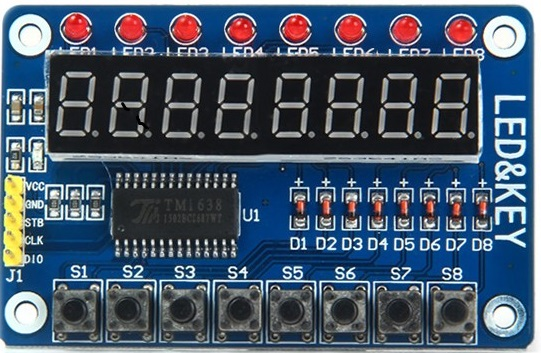
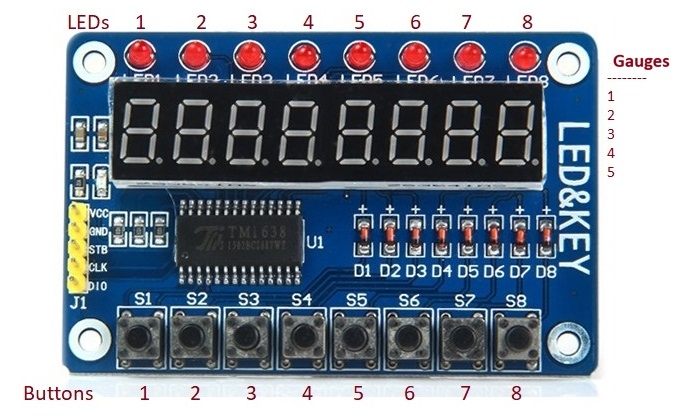

```c++
               ╓───────────╖ 
    ───────────╜  Arduino  ╙──────────── 

/*
  Библиотека управления модулем TM1638 Led&Key

  Версия: 0.6
  Дата:   2026-03-24

  История:
  0.7 2026-06-19  - пример для кнопок
  0.6 2026-03-24  - функция buttons теперь считывает нажатия клавиш, а getButtons вызывает её дважды с интервалом DEBOUNCE_DELAY для избежания дребезга 
  0.5 2024-07-09  - некоторые улучшения кода
  0.4 2018-02-16  - вывод целого числа в указанной позиции и простановка точки
  0.3 2018-02-15  - добавлена возможность выводить десятичную точку (setGrid)
/*
```


# TM1638LedKey

Управление модулем TM1638LedKey



Схема  расположения кнопок и светодиодных индикаторов. 

