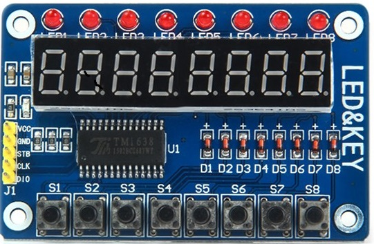
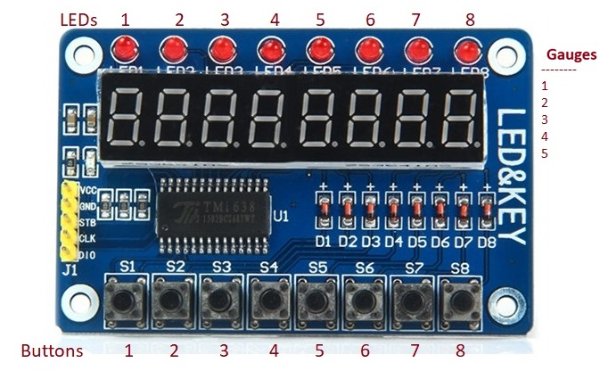

```c++
               ╓───────────╖ 
    ───────────╜  Arduino  ╙──────────── 

/*
  Библиотека управления модулем TM1638 Led&Key

  Версия: 0.9
  Дата:   2026-10-01

  История:
  0.9 2026-10-01  - добавлено неблокирующее чтение кнопок getButtonsNonBlocking(), методы-события buttonPressed()/buttonReleased() и маски фронтов getPressedEvents()/getReleasedEvents()
  0.8 2026-10-01  - исправлены ошибки: чтение кнопок (buttons), переполнение буфера и ограничение позиции в showFloat, ограничение диапазона в setLED/getLED, контроль границ в setGrid
  0.7 2026-06-19  - пример для кнопок
  0.6 2026-03-24  - функция buttons теперь считывает нажатия клавиш, а getButtons вызывает её дважды с интервалом DEBOUNCE_DELAY для избежания дребезга 
  0.5 2024-07-09  - некоторые улучшения кода
  0.4 2018-02-16  - вывод целого числа в указанной позиции и простановка точки
  0.3 2018-02-15  - добавлена возможность выводить десятичную точку (setGrid)
/*
```


# TM1638LedKey

Библиотека для управления модулем **TM1638 Led&Key** (8 светодиодов, 8 семисегментных
индикаторов, 8 кнопок).

- Версия: **0.9**
- Класс: `TM1638LedKey`
- Заголовок: `#include <TM1638LedKey.h>`



Схема  расположения кнопок и светодиодных индикаторов. 



## Подключение

| Модуль | Arduino | Пин по умолчанию |
|--------|---------|------------------|
| VCC    | +5V     | —                |
| GND    | GND     | —                |
| STB    | строб   | 7                |
| CLK    | такт    | 9                |
| DIO    | данные  | 8                |

## Быстрый старт

```cpp
#include <TM1638LedKey.h>

TM1638LedKey tm;                 // типовое подключение: DIO=8, CLK=9, STB=7

void setup() {
    tm.setBrightness(4);         // яркость 4 из 8
    tm.setLED(1, 1);             // включить светодиод 1
    tm.setGrid(1, 5);            // вывести цифру "5" в разряд 1
}

void loop() {
    uint32_t keys = tm.getButtons();
    if (keys & 0x01) {           // нажата кнопка 1 (крайняя слева)
        tm.setLED(1, !tm.getLED(1));
    }
}
```

Пользовательское подключение:

```cpp
TM1638LedKey tm(8, 9, 7);        // (data, clock, strobe)
```

---

## Примеры

Готовые скетчи находятся в каталоге [`examples/`](examples):

| Скетч | Описание |
|-------|----------|
| [`Buttons`](examples/Buttons/Buttons.ino) | События кнопок: `buttonPressed()` / `buttonReleased()` и маски `getPressedEvents()` / `getReleasedEvents()`. Нажатие кнопки переключает её светодиод, отпускание кнопки 8 очищает индикатор. |
| [`test_keys`](examples/test_keys/test_keys.ino) | Кнопки через неблокирующее чтение и маски фронтов; события выводятся в Serial. |
| [`test_TM1638LedKey`](examples/test_TM1638LedKey/test_TM1638LedKey.ino) | Демонстрация возможностей модуля: бегущие светодиоды, индикаторы уровня, шрифт, температура. |
| [`ShowFloat`](examples/ShowFloat/ShowFloat.ino) | Вывод чисел (в том числе отрицательных) методом `showFloat()`. |

Типовой каркас скетча:

```cpp
#include <TM1638LedKey.h>

TM1638LedKey tm;                 // типовое подключение: DIO=8, CLK=9, STB=7

void setup() {
    tm.setBrightness(4);
}

void loop() {
    tm.getButtonsNonBlocking();  // опрос кнопок — раз в цикл, без delay()
    if (tm.buttonPressed(1)) {   // событие: кнопка 1 только что нажата
        tm.setLED(1, !tm.getLED(1));
    }
}
```

---

## Сводка методов

| Метод | Назначение |
|-------|-----------|
| `TM1638LedKey()` / `TM1638LedKey(data, clock, strobe)` | Создание объекта, настройка пинов, очистка индикатора |
| `void setBrightness(uint8_t brightness)` | Яркость индикатора и светодиодов (0 — выключено) |
| `void setLED(uint8_t num, uint8_t on)` | Включить/выключить светодиод |
| `bool getLED(uint8_t num)` | Прочитать сохранённое состояние светодиода |
| `void setGrid(uint8_t grid, uint8_t val, bool dp = false)` | Вывести символ в разряд |
| `void setGauges(uint8_t g1, ..., uint8_t g5)` | Индикаторы уровня (bar-graph) |
| `uint32_t getButtons(void)` | Прочитать нажатые кнопки (антидребезг, блокирующий) |
| `uint32_t getButtonsNonBlocking(void)` | Неблокирующее чтение кнопок (без `delay()`) |
| `bool buttonPressed(uint8_t num)` | Момент нажатия кнопки (фронт) |
| `bool buttonReleased(uint8_t num)` | Момент отпускания кнопки (фронт) |
| `uint32_t getPressedEvents(void)` | Маска только что нажатых кнопок (фронты) |
| `uint32_t getReleasedEvents(void)` | Маска только что отпущенных кнопок (фронты) |
| `void clear(void)` | Погасить все разряды |
| `void showFloat(int32_t val, uint8_t dp, uint8_t pos)` | Вывести целое число (в т.ч. отрицательное) |

---

## Конструкторы

### `TM1638LedKey(void)`

Типовое подключение: `dataPin = 8`, `clockPin = 9`, `strobePin = 7`.
Настраивает пины на вывод и очищает регистры модуля.

### `TM1638LedKey(uint8_t data, uint8_t clock, uint8_t strobe)`

Пользовательское подключение.

| Параметр | Тип | Описание |
|----------|-----|----------|
| `data`   | `uint8_t` | Пин данных (DIO) |
| `clock`  | `uint8_t` | Пин тактирования (CLK) |
| `strobe` | `uint8_t` | Пин строба (STB) |

Оба конструктора сразу вызывают `init()` (настройка пинов) и `reset()` (очистка всех
16 регистров), поэтому создавать объект нужно до обращения к модулю. В `setup()`
дополнительная инициализация не требуется.

---

## Управление яркостью

### `void setBrightness(uint8_t brightness)`

Задаёт яркость одновременно для индикаторов **и** светодиодов (раздельно нельзя).

| Значение `brightness` | Результат |
|-----------------------|-----------|
| `0` | Дисплей выключен |
| `1..8` | Яркость (1 — минимальная, 8 — максимальная) |
| `> 8` | Максимальная яркость |

```cpp
tm.setBrightness(0);   // выключить индикацию
tm.setBrightness(8);   // максимальная яркость
```

---

## Светодиоды

### `void setLED(uint8_t num, uint8_t on)`

Включает или выключает светодиод и запоминает его состояние во внутренней переменной
`leds` (для последующего чтения через `getLED`).

| Параметр | Тип | Описание |
|----------|-----|----------|
| `num` | `uint8_t` | Номер светодиода, **1..8** (слева направо) |
| `on`  | `uint8_t` | `1` — включить, `0` — выключить |

Ограничение значений: `num < 1` → `1`, `num > 8` → `8`; `on > 1` → `1`.

```cpp
tm.setLED(1, 1);   // включить светодиод 1
tm.setLED(8, 0);   // выключить светодиод 8
```

### `bool getLED(uint8_t num)`

Возвращает **сохранённое** состояние светодиода (бит переменной `leds`), а не реально
считанное с микросхемы.

| Параметр | Тип | Описание |
|----------|-----|----------|
| `num` | `uint8_t` | Номер светодиода, 1..8 (значения за пределами зажимаются) |
| **Возврат** | `bool` | `true` — включён, `false` — выключен |

```cpp
tm.setLED(3, 1);
bool state = tm.getLED(3);   // true
```

---

## Разряды индикатора

### `void setGrid(uint8_t grid, uint8_t val, bool dp = false)`

Выводит один символ в указанный разряд семисегментного индикатора.

| Параметр | Тип | Описание |
|----------|-----|----------|
| `grid` | `uint8_t` | Номер разряда, **1..8** (слева направо). Значения вне диапазона зажимаются (`< 1` → `1`, `> 8` → `8`). |
| `val`  | `uint8_t` | Индекс символа в таблице `NUMBER_FONT` (см. ниже). |
| `dp`   | `bool` | `true` — включить десятичную точку в этом разряде (по умолчанию `false`). |

Таблица символов (`NUMBER_FONT`):

| `val` | 0..9 | 10 | 11 | 12 | 13 | 14 | 15 | 16 | 17 |
|-------|------|----|----|----|----|----|----|----|----|
| Символ | 0..9 | A | B | C | D | E | F | `-` | гашение |

Значения `val >= 18` автоматически заменяются на `CLEAR` (гашение).

```cpp
tm.setGrid(1, 5);          // "5" в разряде 1
tm.setGrid(2, 7, true);    // "7." в разряде 2
tm.setGrid(3, MINUS);      // "-" в разряде 3
tm.setGrid(4, CLEAR);      // погасить разряд 4
```

> Значения `grid` вне диапазона `1..8` зажимаются: `0` → разряд 1, `> 8` → разряд 8.

### `void setGauges(uint8_t gauge1, uint8_t gauge2, uint8_t gauge3, uint8_t gauge4, uint8_t gauge5)`

Управляет пятью «шкалами» (bar-graph) на индикаторах. Шкалы `gauge1`, `gauge3`,
`gauge5` — 8-сегментные (диапазон `0..8`), шкалы `gauge2`, `gauge4` — 16-сегментные
(диапазон `0..16`).

```
● ● ● ● ● ● ● ●   gauge1 (0..8)
▮ ▮ ▮ ▮ ▮ ▮ ▮ ▮   gauge2 (0..16)
● ● ● ● ● ● ● ●   gauge3 (0..8)
▮ ▮ ▮ ▮ ▮ ▮ ▮ ▮   gauge4 (0..16)
● ● ● ● ● ● ● ●   gauge5 (0..8)
```

```cpp
tm.setGauges(4, 10, 0, 16, 8);
```

---

## Кнопки

### `uint32_t getButtons(void)`

Возвращает битовую маску нажатых кнопок.

- бит 0 → кнопка 1 (крайняя слева), ..., бит 7 → кнопка 8 (крайняя справа);
- антидребезг: чтение выполняется дважды с паузой `DEBOUNCE_DELAY` (15 мс).
  Если оба чтения совпали — возвращается значение, иначе `0`;
- вызов **блокирующий** (около 15 мс).

```cpp
uint32_t keys = tm.getButtons();
for (uint8_t i = 0; i < 8; i++) {
    if (keys & (1u << i)) {
        // нажата кнопка (i + 1)
    }
}
```

### `uint32_t getButtonsNonBlocking(void)`

Неблокирующий вариант `getButtons()` — **не использует `delay()`**.

- вызывайте функцию **регулярно** (например, в `loop()`);
- состояние считается стабильным, если прочитанные значения не менялись
  не менее `DEBOUNCE_DELAY` (15 мс);
- возвращает маску **стабильно** нажатых кнопок (бит 0 → кнопка 1);
- удобна в программах, где нельзя приостанавливать цикл.

```cpp
void loop() {
    uint32_t keys = tm.getButtonsNonBlocking();  // вызывать каждый цикл
    if (keys & 0x01) {
        // кнопка 1 удерживается нажатой
    }
}
```

### `bool buttonPressed(uint8_t num)` / `bool buttonReleased(uint8_t num)`

Детектирование фронта нажатия/отпускания кнопки (`num` — номер `1..8`, зажимается в диапазон).

- `buttonPressed(num)` — `true` один раз в момент нажатия (при удержании — `false`);
- `buttonReleased(num)` — `true` один раз в момент отпускания;
- перед проверкой вызовите `getButtonsNonBlocking()` **один раз в текущем цикле** —
  он обновляет состояние и фиксирует фронты.

```cpp
void loop() {
    tm.getButtonsNonBlocking();          // опрос — один раз в цикле
    if (tm.buttonPressed(1)) {
        // кнопка 1 только что нажата
    }
    if (tm.buttonReleased(1)) {
        // кнопка 1 только что отпущена
    }
}
```

### Маски фронтов

Для обработки сразу всех кнопок используйте методы, возвращающие битовые маски
фронтов за текущий цикл (бит 0 → кнопка 1, ..., бит 7 → кнопка 8):

- `uint32_t getPressedEvents(void)` — кнопки, только что нажатые;
- `uint32_t getReleasedEvents(void)` — кнопки, только что отпущенные.

```cpp
uint32_t pressed = tm.getPressedEvents();
for (uint8_t i = 0; i < 8; i++) {
    if (pressed & (1u << i)) {
        // кнопка (i + 1) только что нажата
    }
}
```

---

## Индикатор

### `void clear(void)`

Гасит все 8 разрядов индикатора (записывает символ `CLEAR` во все разряды).
Светодиоды не затрагиваются.

```cpp
tm.clear();
```

### `void showFloat(int32_t val, uint8_t dp, uint8_t pos)`

Выводит целое число (в том числе отрицательное), начиная с указанного разряда.

| Параметр | Тип | Описание |
|----------|-----|----------|
| `val` | `int32_t` | Выводимое число (знаковое; отрицательные поддерживаются) |
| `dp`  | `uint8_t` | Позиция десятичной точки: `1` — у первой выведенной цифры, `2` — у второй, ... `0` — без точки |
| `pos` | `uint8_t` | Стартовый разряд, `1..8` (зажимается в диапазон `1..8`) |

Выводятся только значащие цифры (без ведущих нулей), начиная с разряда `pos`.

```cpp
tm.showFloat(1234, 0, 1);    // "1234"
tm.showFloat(1234, 3, 1);    // "12.34"
tm.showFloat(25,   2, 1);    // "2.5"
tm.showFloat(7,    0, 4);    // "   7" (цифра в разряде 4)
tm.showFloat(-1234, 0, 1);   // "-1234"
tm.showFloat(-25,   2, 1);   // "-2.5"
```

> Отрицательные значения поддерживаются: знак `-` выводится в отдельном разряде
> перед цифрами (сам `dp` считается по цифрам, без учёта знака).

---

## Константы и макросы

Доступны после `#include <TM1638LedKey.h>`.

### Команды микросхемы

| Макрос | Значение | Описание |
|--------|----------|----------|
| `CMD_TM1638_DISPLAY_OFF` | `0x87` | Дисплей выключен |
| `CMD_TM1638_DISPLAY_ON` | `0x8F` | Дисплей включён на полную яркость |
| `CMD_TM1638_SET_AUTOINC_ON` | `0x40` | Режим автоинкремента адреса |
| `CMD_TM1638_SET_AUTOINC_OFF` | `0x44` | Режим фиксированного адреса |
| `CMD_TM1638_KEY_SCAN` | `0x42` | Команда чтения кнопок |
| `ADR_TM1638_START` | `0xC0` | Стартовый адрес регистров |
| `DEBOUNCE_DELAY` | `15` | Задержка антидребезга, мс |

### Служебные константы

| Константа | Значение | Описание |
|-----------|----------|----------|
| `DIGITS` | `8` | Число разрядов индикатора |
| `MINUS` | `16` | Индекс символа «-» в `NUMBER_FONT` |
| `CLEAR` | `17` | Индекс символа гашения в `NUMBER_FONT` |
| `NUMBER_FONT[]` | — | Таблица символов (см. раздел «Разряды индикатора») |

---

## Соглашения о нумерации

- Вся нумерация — **с 1**, слева направо, как на плате модуля.
- Светодиоды: `1..8`.
- Разряды индикатора: `1..8`.
- Кнопки: битовая маска, бит 0 — кнопка 1.

---

## Ограничения и замечания

- `showFloat` принимает `int32_t` — поддерживаются отрицательные числа (знак `-` занимает один разряд); выводится не более 8 разрядов (более длинные числа обрезаются).
- `getButtons` блокирует выполнение примерно на `DEBOUNCE_DELAY` (15 мс); неблокирующий вариант — `getButtonsNonBlocking` (требует регулярного вызова в `loop()`).
- `setGrid`: `grid` зажимается в диапазон `1..8` (`0` → разряд 1, `> 8` → разряд 8); `val >= 18` → гашение.
- `setLED` / `getLED`: `num` вне диапазона `1..8` зажимается в допустимый диапазон.
- `getLED` возвращает **сохранённое** состояние (переменная `leds`), а не считанное с модуля.
- Яркость (`setBrightness`) общая для индикаторов и светодиодов.
